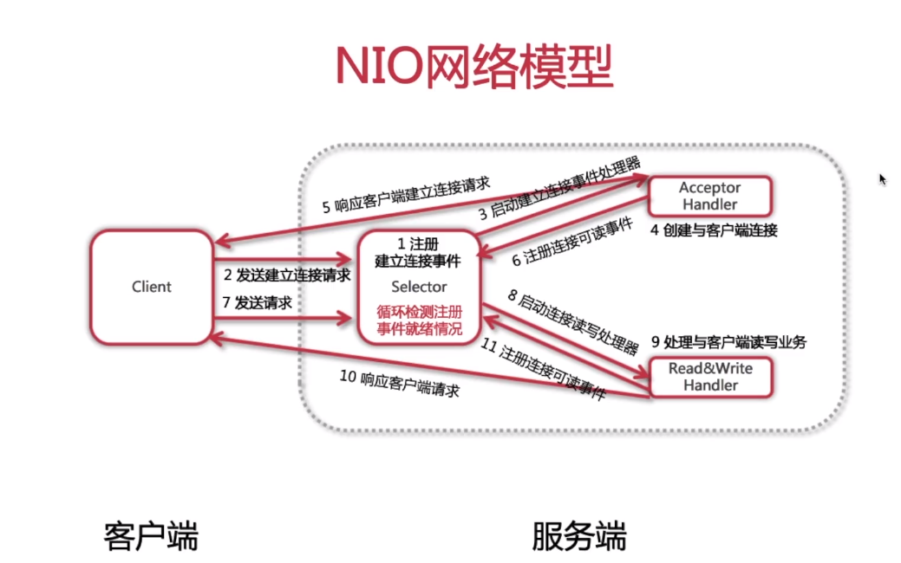

### NIO网络编程模


### NIO网络模型改进
 * 非阻塞式I/O模型
 * 弹性伸缩能力强
 * 单线程节省资源

### NIO核心
 * Channel：通道
 * Buffer：缓冲区
 * Selector：选择器或多路复用器

### NIO核心类之Channel
 #### Channel简介
 * 双向性
 * 非阻塞性
 * 操作唯一性
 
 #### Channel实现
 * 文件类：FileChannel
 * UDP类：DatagramChannel
 * TCP类：ServerSocketChannel/SocketChannel

 #### Channel使用
```
    /**
     * 代码片段1：服务端通过服务端Socket创建Channel
     */
    ServerSocketChannel serverChannel = ServerSocketChannel.open();

    /**
     * 代码片段2：服务端绑定端口
     */
    serverChannel.bind(new InetSocketAddress(8000));

    /**
     * 代码片段3：服务端监听客户端连接，建立socketChannel连接
     */
    SocketChannel socketChannel = serverChannel.accept();

    /**
     * 代码片段4：客户端连接远程主机及端口
     */
    SocketChannel clientSocketChannel = SocketChannel.open(new InetSocketAddress("127.0.0.1", 8000));
```

### NIO核心类之Buffer
 #### Buffer简介
  * 作用：读写Channel中数据
  * 本质：一块内存区域
  
 #### Buffer属性
  * Capacity：容量
  * Position：位置
  * Limit：上限
  * Mark：标记
  
 #### Buffer使用
```
    // 初始化长度为10的byte类型buffer
    ByteBuffer.allocate(10);

    // 向byteBuffer中写入3个字节
    byteBuffer.put("abc".getBytes(Charset.forName("utf-8")));

    // 将byteBuffer从写模式切换成读模式
    byteBuffer.flip();

    // 从byteBuffer中读取一个字节
    byteBuffer.get();

    // 调用mark方法记录下当前position的位置
    byteBuffer.mark();

    // 先调用get方法读取下一个字节，再调用reset方法将position重置到mark位置
    byteBuffer.get();
    byteBuffer.reset();

    // 调用clear方法，将所有的属性重置
    byteBuffer.clear();
```

### NIO核心类之Selector
 #### Selector简介
  * 作用：I/O就绪选择
  * 地位：NIO网络编程的基础
 
 #### Selector使用
```
    // 创建Selector
    Selector selector = Selector.open();

    // 将Channel注册到selector上，监听读就绪事件
    SelectionKey selectionKey = channel.register(selector, SelectionKey.OP_READ);

    // 阻塞等待channel有就绪事件发生
    int selectNum = selector.select();

    // 获取发生就绪事件的channel集合
    Set<SelectionKey> selectedKeys = selector.selectedKeys();
```

 #### SelectionKey简介
  * 四种就绪状态常量
  * 有价值的属性
  
### NIO编程实现步骤
 1. 创建Selector
 2. 创建ServerSocketChannel，并绑定监听端口
 3. <font color="red">将Channel设置为非阻塞模式</font>
 4. 将Channel注册到Selector上，监听连接事件
 5. 循环调用Selector的select方法，检测就绪情况
 6. 调用selectKeys方法获取就绪channel集合
 7. 判断就绪事件种类，调用业务处理方法
 8. 根据业务需要决定是否再次注册监听事件，重复执行第三步操作
  
### NIO网络编程缺陷
 * 复杂：NIO类库和API繁杂
 * 心累：可靠性能力补齐，工作量和难度都非常大
 * 有坑：Selector空轮询，导致CPU 100%
 